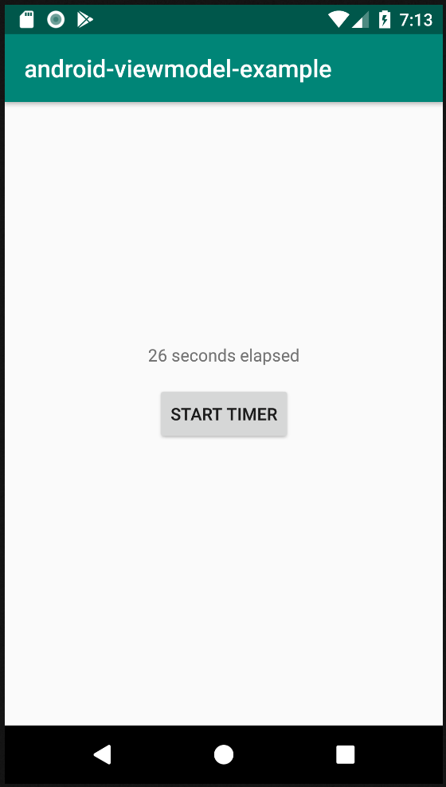

# android-viewmodel-example
This project is about simple and quick example of using ViewModel and LiveData where I am updating the TextView on every second which start/stop with button  click and this countdown will not be reset in configuration changes like device rotation.

Also the scope of viewmodel is specified here which is very important to understand.

